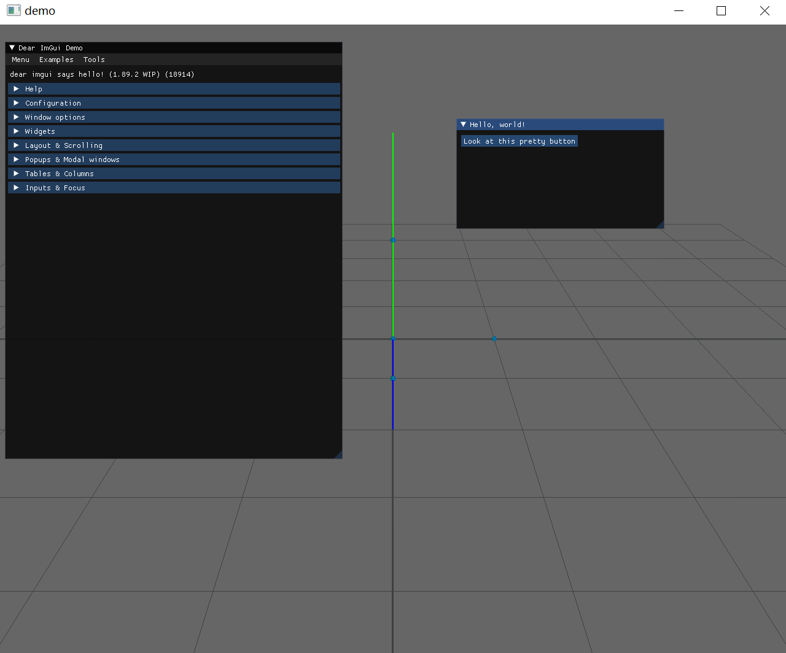

基于OpenGL的最小化的可视化工具， 依赖于eigen, glfw和imgui这三个库。
改写自 [PositionBasedDynamics](https://github.com/InteractiveComputerGraphics/PositionBasedDynamics)中的MiniGL部分。

主要功能是对流体进行粒子的可视化，并带有简单的坐标系和地面。使用滚轮缩放，中键平移，右键旋转。

使用方法看main.cpp中的render函数。 只需要提供一个代表粒子位置的particlePos数组，该数组的类型为std::vector<Vector3r>。

在windows平台下VS2022中可正常运行。编译系统基于CMake。

## 说明
1. ImguiEaseUse: 对imgui的简单的封装。在render loop前调用`ImguiEasyUse::init()`, 在render loop后调用`ImguiEasyUse::cleanup()`, 在render loop中调用`ImguiEasyUse::render()`。在renderThings中扩充自己的imgui控件。  